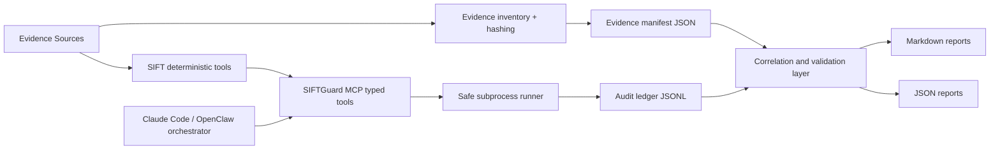

# Architecture v0

## Design principles
- Read-only evidence semantics by default.
- Deterministic orchestration and stable audit output.
- Typed module boundaries over ad-hoc command execution.
- Every finding traceable to evidence refs and audit events.
- Small, testable Python modules over broad incomplete features.

## System overview

## Read-only enforcement
- Case evidence is expected under `cases/` and treated as immutable input.
- Output paths are constrained to `runs/` in higher-level workflows.
- Policy modules reject risky commands and shell-style token injection.

## Tool boundary
- MCP surface is typed and explicit.
- Arbitrary shell execution is not exposed as an MCP tool.
- Runner wrappers only execute vetted commands via policy checks.

## Evidence provenance
- Artifacts are hashed with SHA256.
- Manifest entries include deterministic artifact IDs.
- Execution events are appended to JSONL ledger with stable fields.
- Parser outputs are expected to be hashed and ledgered in later milestones.

## Self-correction target
- M4 will add structured self-correction loops that revise hypotheses without mutating evidence.

## Why arbitrary shell execution is not exposed
- To reduce misuse risk, preserve reproducibility, and keep behavior auditable.
- Explicit tool contracts are easier to test and validate than free-form shell access.
