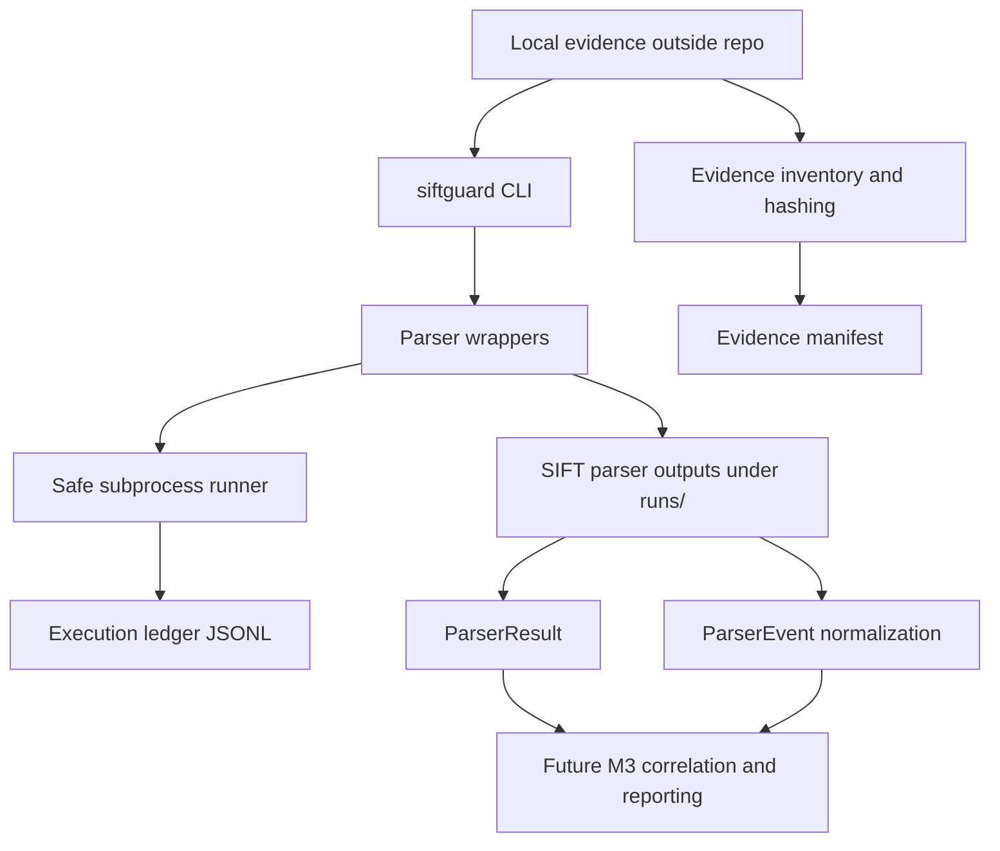

# Architecture

## Design Principles

- Treat evidence roots as read-only inputs.
- Keep generated outputs under `runs/`.
- Use explicit typed interfaces instead of arbitrary shell execution.
- Preserve parser output, warnings, errors, hashes, and audit records.
- Normalize parser observations without producing final findings.

## System Overview

```text
Local evidence outside repo
  |
  v
siftguard CLI / future MCP tool schema
  |
  v
parser wrapper
  |
  +--> safe runner + execution ledger
  |
  +--> SIFT tool output under runs/
  |
  v
ParserResult + normalized ParserEvent records
  |
  v
M3 correlation and claim-proof reporting, future work
```



## Components

- CLI entrypoints expose inventory, hashing, audit reading, and parser wrapper
  commands.
- MCP parser tool descriptors define constrained schemas for future MCP use.
  Full runtime wiring is not the current parser workflow.
- Evidence inventory and hashing create deterministic manifest records.
- Parser wrappers call verified SIFT tools:
  - MFTECmd for `$MFT`.
  - RECmd for Registry Run/RunOnce keys.
  - AmcacheParser for `Amcache.hve`.
- The safe subprocess runner executes argv-style commands, writes stdout/stderr
  logs under `runs/`, and appends audit events.
- The execution ledger is JSONL.
- `ParserResult` captures parser status, command, output files, hashes,
  warnings, errors, timing, and normalized events.
- `ParserEvent` records are observations extracted from parser output.

## Boundaries

Evidence roots are inputs, not output locations. Parser wrappers must not write
to evidence roots. The `runs/` directory is the output boundary for parser CSVs,
logs, normalized results, and audit ledgers.

Parser wrappers do not directly produce final findings. Later M3 work can use
normalized observations as inputs to correlation and claim-proof reporting.

## Command Safety

Parser commands are configured as argv elements. Public CLI and MCP schema
surfaces do not expose arbitrary command, shell, executable, or argv fields.
