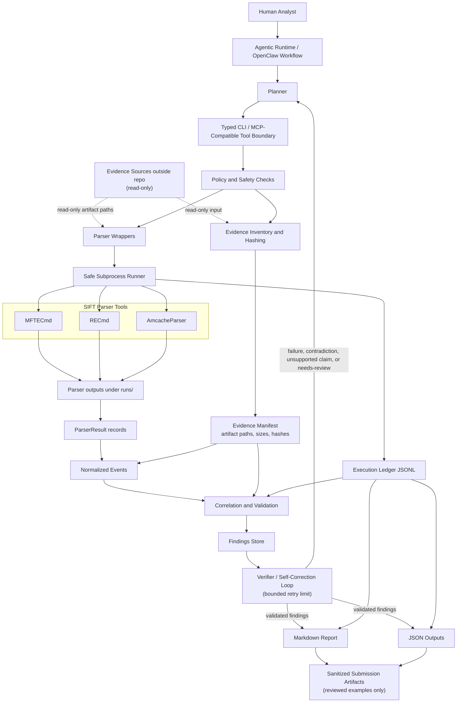

# Architecture

## Design Principles

- Treat evidence roots as read-only inputs.
- Keep generated outputs under `runs/` or another ignored generated-output
  root.
- Use explicit typed interfaces instead of arbitrary shell execution.
- Preserve parser output, warnings, errors, hashes, and audit records.
- Normalize parser observations before correlation creates findings.
- Require validation before findings are rendered into analyst-readable reports.

## System Overview

SIFTGuard MCP is a local-first, analyst-assist triage workflow. A human analyst
starts a constrained run, the agent plans supported workflow steps, typed CLI and
MCP-compatible schemas constrain execution, parser wrappers call deterministic
SIFT tools, and validation controls which findings can appear in final outputs.



Raw evidence flows into the system only as read-only input. Generated parser
outputs, logs, reports, JSON files, and agent records flow to `runs/` or another
ignored generated-output root. Any committed submission artifact should be a
reviewed and sanitized example, not raw evidence or private run output.

## How To Read This Diagram

- The analyst starts a local run from a SIFT/Linux-compatible terminal.
- The agentic runtime forms a plan for the supported inventory, parse,
  correlate, validate, report, and verify phases.
- The typed CLI and MCP-compatible boundary constrains execution to documented
  commands and schemas.
- Evidence inventory records artifact metadata and hashes without writing into
  the evidence root.
- Parser wrappers call deterministic SIFT tools for `$MFT`, Registry
  Run/RunOnce keys, and `Amcache.hve`.
- The safe subprocess runner writes stdout/stderr logs and execution-ledger
  entries for tool activity.
- Parser results are normalized into observation records before correlation.
- Correlation and validation distinguish confirmed, inferred, rejected, and
  needs-review findings.
- The verifier blocks or downgrades unsupported claims and can trigger bounded
  targeted correction when allowed.
- Reports and JSON outputs are generated from validated finding objects.

## Traceability Model

A final report sentence should be traceable through this chain:

```text
report sentence
  -> finding ID
  -> evidence reference
  -> normalized event
  -> parser result
  -> execution ledger entry
  -> tool output path / raw parser output reference
  -> original evidence artifact hash
```

The project is designed so confirmed and inferred findings carry evidence
references, raw-record context where available, artifact hash support or an
explicit hash limitation, and audit-event references. Parser observations are not
findings by themselves; they become reportable only after correlation and
validation.

## Boundary Model

- Evidence roots are input-only and should be staged outside the repository.
- Output roots are generated paths such as `runs/`, `outputs/`, `analysis/`, or
  `reports/generated/`.
- Raw evidence and generated parser outputs should not be committed.
- Sanitized examples may be committed only after explicit review for private
  data, secrets, local paths, hostnames, usernames, and tokens.
- Public tool input does not accept free-form shell strings.
- Argv-style commands and typed schemas are the execution safety boundary.
- The agent uses constrained SIFTGuard entrypoints as the primary forensic
  interface, not arbitrary shell authority.
- Analyst review remains required before using findings outside triage.

## Supported Scope

The submission-ready scope is Windows disk-artifact triage focused on:

- MFT records parsed through `MFTECmd`.
- Registry `Run` and `RunOnce` persistence keys parsed through `RECmd`.
- Amcache execution evidence parsed through `AmcacheParser`.
- Drop, persistence, and execution correlation from normalized events.

The final submission scope does not include memory forensics, packet or network
analysis, cloud incident response, remote endpoint triage, offensive operations,
legal evidence certification, or broad SIFT automation.

## Components

- CLI entrypoints expose inventory, hashing, audit reading, parser wrappers,
  correlation, and the constrained agent workflow.
- MCP-compatible parser and correlation descriptors define typed schemas for
  supported workflow boundaries. The OpenClaw-facing runtime path is the
  bounded MCP/tool adapter documented in `docs/openclaw-mcp-workflow.md`.
- Evidence inventory and hashing create deterministic manifest records.
- Parser wrappers call verified SIFT tools:
  - `MFTECmd` for `$MFT`.
  - `RECmd` for Registry `Run`/`RunOnce` keys.
  - `AmcacheParser` for `Amcache.hve`.
- The safe subprocess runner executes argv-style commands, writes stdout/stderr
  logs under generated output paths, and appends audit events.
- The execution ledger is JSONL.
- `ParserResult` captures parser status, command, output files, hashes,
  warnings, errors, timing, and normalized events.
- `ParserEvent` records are observations extracted from parser output.
- Correlation and validation create findings from normalized events and control
  which findings can support reports.
- Agent audit records capture plan, execution, verification, correction, and
  completion events.

## Command Safety

Parser commands are configured as argv elements. Public CLI and MCP-compatible
schema surfaces do not expose arbitrary command, shell, executable, or argv
fields. Local parser executable overrides are validated as single executable
values, and shell metacharacters are rejected.
